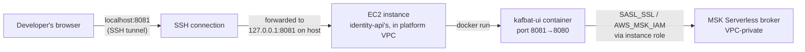

# Kafka UI Access Design

**Spec**: `.specs/features/kafka-ui-access/spec.md`
**Status**: Draft

---

## Research

**kafbat-ui** (`ghcr.io/kafbat/kafka-ui`, the maintained fork of the original Provectus `kafka-ui`) ships `aws-msk-iam-auth` built in — no custom image build needed. Confirmed via Context7 (`/kafbat/kafka-ui`) and the project's own docs (`ui.docs.kafbat.io/configuration/authentication/for-kafka/aws-iam`):

- Auth is configured entirely through `KAFKA_CLUSTERS_0_PROPERTIES_*` env vars, which pass straight through to the underlying Kafka client (`Map<String, Object> properties` in `ClustersProperties.java`).
- `SASL_JAAS_CONFIG=software.amazon.msk.auth.iam.IAMLoginModule required;` (no `awsProfileName`/`awsRoleArn` params) uses the AWS SDK's **default credential provider chain** — on an EC2 instance, that resolves to the instance's IAM role via IMDS. No static credentials, no profile file needed in the container.
- This is the exact same underlying Java library (`aws-msk-iam-auth`) that identity-api/comms-api use indirectly through `AWS.MSK.Auth` (the .NET port) — same auth semantics, proven working against this cluster already this session.

**Uncertain / not verified**: whether kafbat-ui's message browser decodes Avro without a Schema Registry configured (not needed for this feature — payloads are plain JSON per `docs/contracts/notification-requested.md`, so this doesn't block anything, just flagging it wasn't checked).

---

## Architecture Overview

kafka-ui runs as a second Docker container on the *same* EC2 instance already running the app (identity-api's, by convention — either app repo's instance would work identically since both carry the `kafka-cluster:*` inline IAM policy already). It is not Terraform-managed; it is started/stopped by a plain shell script, matching how this session's throwaway diagnostic tools were run (SSH onto an already-provisioned instance, no new infrastructure).

No new security group rule: the SSH connection (already how this session accessed the instance) carries the forwarded traffic; kafka-ui's port 8081 is never opened to `0.0.0.0/0`.

---

## Code Reuse Analysis

### Existing Components to Leverage

| Component | Location | How to Use |
|---|---|---|
| EC2 instance's existing IAM role (`kafka-cluster:*` inline policy) | `rentifyx-identity-api/iac/terraform/modules/ec2/main.tf` (`ec2_kafka` policy) | Reused as-is via IMDS — kafka-ui needs no new IAM grant |
| `/rentifyx/platform/kafka/bootstrap-servers` SSM parameter | `rentifyx-platform/modules/kafka/main.tf` | Script fetches this at start time instead of hardcoding the broker address (this session's C# bootstrap tool hardcoded it — a FIXME noted at the time; this script fixes that pattern) |
| `rentifyx-deploy-temp`-style SSH key pattern | This session's manual `aws ec2 import-key-pair` workflow | Same access path — SSH key + `ssh_key_name` var already wired into both app repos' `modules/ec2` |

### Integration Points

| System | Integration Method |
|---|---|
| MSK Serverless | SASL_SSL / `AWS_MSK_IAM`, same mechanism as the app containers' own Kafka clients |
| EC2 instance | Docker container started via a shell script run over SSH, not part of `userdata.sh.tpl` (this is an on-demand debugging tool, not part of the app's boot sequence) |

---

## Components

### `scripts/start-kafka-ui.sh`

- **Purpose**: Start (or restart) the kafka-ui container on an already-running app EC2 instance, pointed at the real MSK Serverless cluster.
- **Location**: `rentifyx-platform/scripts/start-kafka-ui.sh` (lives in the platform repo since it's Kafka's owning repo, even though it targets an app repo's EC2 — same cross-repo relationship as the `terraform_remote_state` outputs)
- **Behavior**:
  1. Resolve the broker address at run time via `aws ssm get-parameter --name /rentifyx/platform/kafka/bootstrap-servers --with-decryption` — never hardcoded (KUI-01 dependency)
  2. `docker run -d --name kafka-ui --restart unless-stopped -p 8081:8080 -e KAFKA_CLUSTERS_0_NAME=rentifyx -e KAFKA_CLUSTERS_0_BOOTSTRAPSERVERS=<resolved> -e KAFKA_CLUSTERS_0_PROPERTIES_SECURITY_PROTOCOL=SASL_SSL -e KAFKA_CLUSTERS_0_PROPERTIES_SASL_MECHANISM=AWS_MSK_IAM -e KAFKA_CLUSTERS_0_PROPERTIES_SASL_CLIENT_CALLBACK_HANDLER_CLASS=software.amazon.msk.auth.iam.IAMClientCallbackHandler -e 'KAFKA_CLUSTERS_0_PROPERTIES_SASL_JAAS_CONFIG=software.amazon.msk.auth.iam.IAMLoginModule required;' ghcr.io/kafbat/kafka-ui:latest`
- **Dependencies**: Must be run *on* the target EC2 instance (via SSH), since the SSM parameter fetch and the broker connection both need to happen from inside the VPC — same constraint that shaped every Kafka-touching tool built this session.
- **Reuses**: `--restart unless-stopped` pattern (KUI-08), identical to how `userdata.sh.tpl` runs the app containers.

### `docs/kafka-ui.md` (usage doc, not code)

- **Purpose**: One-page runbook — how to start it, how to open the SSH tunnel, how to stop it.
- **Location**: `rentifyx-platform/docs/kafka-ui.md`
- **Content**: the `scp` + `ssh <run script>` + `ssh -L 8081:localhost:8081` sequence, written out concretely (mirrors this session's SSH command patterns already proven working).

---

## Data Models

Not applicable — no new persistent data, no new AWS resource, no Terraform state.

---

## Error Handling Strategy

| Error Scenario | Handling | User Impact |
|---|---|---|
| MSK cluster doesn't exist yet (no `terraform apply` run) | `aws ssm get-parameter` fails with `ParameterNotFound` — script exits with that error before even attempting `docker run` | Clear, immediate failure — not a silent hang (KUI edge case in spec.md) |
| SSH tunnel not open when browsing to `localhost:8081` | Browser connection refused | Developer knows immediately to open the tunnel first — no ambiguity |
| kafka-ui container already running (re-run of the script) | `docker rm -f kafka-ui` before `docker run`, same idempotent-redeploy pattern already used for the app containers all session | Safe to re-run the script any number of times |

---

## Tech Decisions

| Decision | Choice | Rationale |
|---|---|---|
| Which EC2 hosts it | identity-api's, by convention | Arbitrary tie-break — both app repos' instances carry identical `kafka-cluster:*` IAM grants and VPC placement; picking one avoids the script needing a parameter for "which instance" |
| No kafka-ui basic-auth login | Skipped | Spec's P2 already treats the SSH tunnel itself as the access control boundary (same boundary as SSH access to the EC2 already implies) — adding a second login layer is ceremony without a corresponding new exposure to defend against |
| Not Terraform-managed | Plain shell script, not an IaC resource | Matches the spec's explicit Out of Scope ("no lifecycle tied to `terraform destroy`") — this is a debugging tool started/stopped on demand, not a resource that needs drift detection or state tracking |
| Broker address resolved at runtime, not hardcoded | `aws ssm get-parameter` inside the script | Avoids repeating this session's known FIXME (the C# bootstrap tool hardcoded the broker address) |
