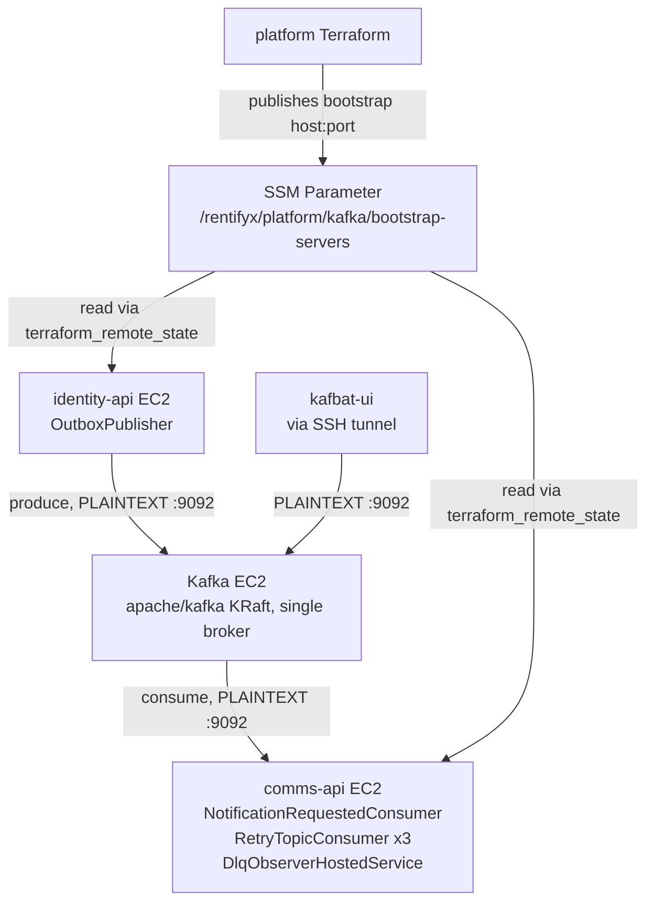

# Self-Hosted Kafka (replace AWS MSK Serverless) Design

**Spec**: `.specs/features/self-hosted-kafka/spec.md`
**Status**: Approved

---

## Architecture Overview

`modules/kafka` in `rentifyx-platform` is rewritten in place (same module name, same consumers of its outputs) from an MSK Serverless cluster to a single EC2 instance running Apache Kafka's official Docker image (`apache/kafka`, KRaft combined mode — one process is both broker and controller, no Zookeeper). The instance lives in the platform VPC's private subnet, same placement MSK Serverless had. `rentifyx-identity-api` and `rentifyx-communications-api`'s EC2 instances (in the same VPC's public subnets) reach it over the VPC-internal network, same as they reached MSK — only the security-group port changes (9092 plaintext instead of 9098 SASL/IAM), and the SSM parameter now holds a plain `host:port` instead of a SASL/IAM bootstrap string.

---

## Code Reuse Analysis

### Existing Components to Leverage

| Component | Location | How to Use |
| --- | --- | --- |
| `modules/ec2` pattern (identity-api) | `rentifyx-identity-api/iac/terraform/modules/ec2/{main,variables,userdata.sh.tpl}` | Copy the EC2-provisioning shape (AMI lookup with `lifecycle { ignore_changes = [ami] }`, IAM role + SSM managed-instance-core attachment, security group, `templatefile()`-driven `userdata.sh.tpl`) into a new `rentifyx-platform/modules/kafka`'s EC2 resource — no app/ECR pieces needed, just the instance + Docker bootstrap |
| `aws_ssm_parameter.kafka_bootstrap_servers` | `modules/kafka/ssm.tf` | Same resource, same name/path (`/rentifyx/platform/kafka/bootstrap-servers`) — only its `value` source changes from `aws_msk_serverless_cluster.this.bootstrap_brokers_sasl_iam` to the new EC2's private IP + port |
| `kafka_ssm_parameter_path` output pattern already consumed by both app repos | `rentifyx-identity-api/iac/terraform/main.tf`, `rentifyx-communications-api/iac/terraform/main.tf` | No change needed — both already do `try(data.terraform_remote_state.platform.outputs.kafka_ssm_parameter_path, "")` + `data.aws_ssm_parameter`, which works identically regardless of what's behind the parameter |
| `scripts/start-kafka-ui.sh` / `docs/kafka-ui.md` (`kafka-ui-access` feature) | `rentifyx-platform/scripts/`, `rentifyx-platform/docs/` | Reused as-is for the SSH-tunnel access pattern; only the kafbat-ui container's Kafka client config changes (no `IAMLoginModule`, plain `bootstrap.servers`) |

### Integration Points

| System | Integration Method |
| --- | --- |
| `rentifyx-identity-api`'s `KafkaProducerFactory` | Drops the `IHostEnvironment`-gated SASL/IAM branch entirely; always builds a plain `ProducerConfig { BootstrapServers = ... }` with no `SecurityProtocol`/`SaslMechanism` set (Confluent.Kafka defaults to plaintext) |
| `rentifyx-communications-api`'s `KafkaConsumerFactory` / `KafkaProducerFactory` (Infrastructure, used by `KafkaFailureRouter`) | Same simplification as above, in both files |
| `AWS.MSK.Auth` NuGet package | Removed from `Directory.Packages.props` and both referencing `.csproj` files in both app repos |
| `rentifyx-identity-api`/`rentifyx-communications-api`'s `modules/ec2/variables.tf`'s `kafka_client_policy_json` | No longer wired — `rentifyx-platform`'s `module.kafka` stops emitting a `client_iam_policy_json` output (nothing to grant IAM access to anymore); the app repos' root `main.tf` calls simply stop passing this var to `module.ec2` (it already defaults to `""`, so the `count`-gated `aws_iam_role_policy.ec2_kafka` resource cleanly no-ops) |

---

## Components

### `rentifyx-platform/modules/kafka` (rewritten)

- **Purpose**: Provisions one EC2 instance running self-hosted Kafka (KRaft, single broker) and publishes its bootstrap address to SSM, replacing the MSK Serverless cluster this module used to create.
- **Location**: `modules/kafka/{main.tf,variables.tf,outputs.tf,ssm.tf,userdata.sh.tpl}`
- **Resources**:
  - `aws_security_group.kafka` — replaces `aws_security_group.msk`; ingress on `9092/tcp` scoped to `var.vpc_cidr` (matches the existing MSK security group's VPC-CIDR-scoping rationale, same cross-repo-SG-reference limitation documented there)
  - `data.aws_ami.amazon_linux_2023` + `aws_instance.kafka` — same AMI-lookup/`lifecycle.ignore_changes` pattern as identity-api's `modules/ec2`; `t3.micro` instance type (single broker, low/no traffic outside test sessions)
  - `aws_iam_role.kafka` + `AmazonSSMManagedInstanceCore` attachment — for the same SSM-based deploy/debug access pattern already used on both app EC2s (no app-specific IAM policy needed; this instance has no AWS API calls of its own beyond what the Docker container needs, which is none)
  - `aws_ssm_parameter.kafka_bootstrap_servers` — unchanged resource, `value` now sourced from `"${aws_instance.kafka.private_ip}:9092"` instead of the MSK cluster attribute
- **Dependencies**: `var.vpc_id`, `var.private_subnets` (reused from `module.network`, same as today)
- **Reuses**: identity-api's `modules/ec2` EC2-provisioning shape (see Code Reuse Analysis)
- **Removed**: `aws_msk_serverless_cluster.this`, `data.aws_iam_policy_document.kafka_client`, the `client_iam_policy_json` output, the `msk_sasl_iam`/`msk_sasl_iam_vpc`/`msk_all` security group rules

### `modules/kafka/userdata.sh.tpl` (new)

- **Purpose**: Cloud-init script that installs Docker and starts the `apache/kafka` container in KRaft combined mode on first boot.
- **Location**: `modules/kafka/userdata.sh.tpl`
- **Key env vars** (per Apache Kafka's official image, confirmed via web search — `KAFKA_PROCESS_ROLES=broker,controller`, `KAFKA_NODE_ID=1`, `KAFKA_CONTROLLER_QUORUM_VOTERS=1@localhost:9093`):
  - `KAFKA_LISTENERS=PLAINTEXT://:9092,CONTROLLER://:9093`
  - `KAFKA_ADVERTISED_LISTENERS=PLAINTEXT://${private_ip}:9092` — **must** be the instance's real private IP (templated in via Terraform, not `localhost`), since clients connecting from identity-api/comms-api's EC2 instances receive this address from the broker's metadata response and reconnect to it directly; getting this wrong is the single most common KRaft-in-Docker failure mode per the research above (client connects once, then fails on broker metadata)
  - `KAFKA_AUTO_CREATE_TOPICS_ENABLE=true` — matches MSK Serverless's always-on auto-topic-creation behavior, so no topic-management code path changes
- **Dependencies**: none beyond Docker itself (`amazon-linux-extras install docker` / `dnf install docker`, matching identity-api's own userdata pattern)
- **Reuses**: `templatefile()` invocation pattern from identity-api's `modules/ec2/main.tf`

### `KafkaProducerFactory` / `KafkaConsumerFactory` (both app repos, 3 files total)

- **Purpose**: Build Confluent.Kafka client configs. Simplified to drop all SASL/IAM logic.
- **Location**: `RentifyxIdentity.Infrastructure/Messaging/KafkaProducerFactory.cs`; `RentifyxCommunications.Api/Messaging/KafkaConsumerFactory.cs`; `RentifyxCommunications.Infrastructure/Messaging/KafkaProducerFactory.cs`
- **Interfaces**: unchanged (`IKafkaProducerFactory.Create()`, `IKafkaConsumerFactory.Create(string groupIdSuffix)`)
- **Change**: remove the `IHostEnvironment environment` constructor dependency (no longer branches on prod vs. non-prod — both are now plaintext, identical to what local dev's Aspire Kafka container already does), remove `AWSMSKAuthTokenGenerator`/`RegionEndpoint`/`SetOAuthBearerTokenRefreshHandler`, remove the `AWS.MSK.Auth`/`Amazon` (core) `using` directives no longer needed
- **Dependencies**: `IConfiguration` only (for the `kafka` connection string)
- **Reuses**: N/A — this is a deletion/simplification, not new code

---

## Data Models

Not applicable — no new persisted data models. The SSM parameter's *shape* changes (plain `host:port` string instead of an opaque SASL/IAM bootstrap string) but its type (`SecureString`) and consuming pattern (`data.aws_ssm_parameter`, `with_decryption = true`) are unchanged.

---

## Error Handling Strategy

| Error Scenario | Handling | User Impact |
| --- | --- | --- |
| Kafka EC2 instance not yet reachable when producer/consumer starts | Confluent.Kafka's client already retries broker metadata fetches internally (existing behavior, unchanged by this feature) | Transient connection errors in logs until the instance finishes booting; no code change needed |
| `KAFKA_ADVERTISED_LISTENERS` misconfigured (e.g. left as `localhost`) | Caught during Design's own research (see userdata component notes) — templated from `aws_instance.kafka.private_ip`, never hardcoded | N/A if implemented per design; flagged explicitly here because it's the most likely mistake to reintroduce |
| Kafka EC2 replaced (AMI update, manual reboot) | Topics/messages lost — already accepted in spec's Edge Cases, no mitigation built (no persistent EBS-backed log dir in this scope) | Acceptable for a study project; document in STATE.md so it isn't mistaken for a bug |

---

## Tech Decisions (only non-obvious ones)

| Decision | Choice | Rationale |
| --- | --- | --- |
| Docker image | `apache/kafka` (official, KRaft combined mode) | Confirmed via web search (Docker Hub `apache/kafka`) as the current officially-published image supporting single-process broker+controller KRaft mode — no third-party image needed |
| Broker placement | New dedicated EC2 in `rentifyx-platform`, not reusing an app repo's EC2 | User's explicit choice (2026-07-21) — keeps cross-repo infra ownership consistent with `module.network`/`module.kafka`'s existing precedent, avoids coupling a 2-consumer dependency into 1 app's repo |
| Auth mechanism | PLAINTEXT, no SASL | User's explicit choice (2026-07-21) — trust boundary is the security group; simplicity over defense-in-depth for a study project with no persistent/sensitive broker data |
| Module name/path | Keep `modules/kafka` (rewrite in place), don't create `modules/kafka-broker` | Minimizes root `main.tf`/output-consumer churn — `module "kafka"` block, `kafka_ssm_parameter_path` output name, and both app repos' `terraform_remote_state` reads all stay unchanged; only the module's internals and the SSM parameter's *value* change |
| `client_iam_policy_json` output | Removed entirely (not left as an empty-string no-op) | Nothing consumes it once there's no IAM auth to grant — keeping a permanently-empty output would be dead code, not a real compatibility shim |

---

## Cross-Repo Task Summary (for Tasks phase)

- **`rentifyx-platform`**: rewrite `modules/kafka` (main.tf, variables.tf, outputs.tf, ssm.tf, new userdata.sh.tpl); update `docs/kafka-ui.md`/`scripts/start-kafka-ui.sh` to drop `IAMLoginModule` config
- **`rentifyx-identity-api`**: simplify `KafkaProducerFactory`; remove `AWS.MSK.Auth` package reference; stop passing `kafka_client_policy_json` to `module.ec2` in root `main.tf`
- **`rentifyx-communications-api`**: simplify both `KafkaProducerFactory` and `KafkaConsumerFactory`; remove `AWS.MSK.Auth` package reference; stop passing `kafka_client_policy_json` to `module.ec2` in root `main.tf`
