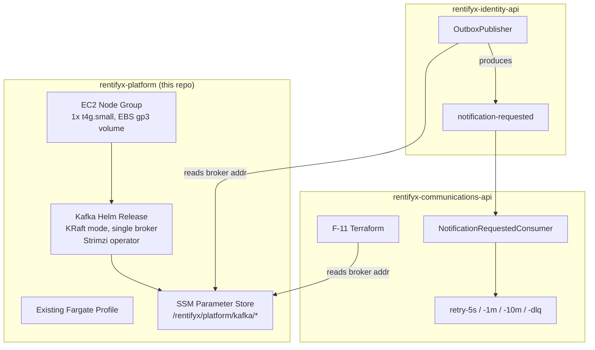

# Shared Kafka Cluster on EKS — Design

**Spec**: `.specs/features/shared-kafka-eks/spec.md`
**Status**: Draft

---

## R-02 Resolution: Fargate storage risk

**Research (web, 2026-07-15) confirms both halves of the risk flagged in spec.md:**

1. **EBS cannot mount on Fargate pods at all.** AWS's own docs: EBS CSI *controller* can run on
   Fargate, but the EBS CSI *node* DaemonSet (the part that actually attaches a volume to a pod)
   can only run on EC2 instances. This isn't a config gap — it's architecturally impossible on
   Fargate. Ref: [Use Kubernetes volume storage with Amazon EBS — Amazon EKS](https://docs.aws.amazon.com/eks/latest/userguide/ebs-csi.html).
2. **EFS is technically usable but a known-bad fit for Kafka specifically**, not just "acceptable
   with a performance caveat" as spec.md provisionally framed it. NFS-backed Kafka has a
   documented, reproducible failure mode — the "silly rename" issue crashes the broker during
   partition reassignment/resizing, which is not a rare maintenance operation, it's routine
   cluster operation. Kafka's own community guidance is to avoid NAS/NFS storage outright: higher
   latency, wider latency variance, single point of failure. Ref:
   [KAFKA-13995 — Does Kafka support NFS? Is it recommended in Production?](https://issues.apache.org/jira/browse/KAFKA-13995),
   [Cloudera Kafka Best Practices](https://community.cloudera.com/t5/Community-Articles/Kafka-Best-Practices/ta-p/249371).

**Decision: Option (a) — a small dedicated EC2 node group alongside the existing Fargate profile,
running Kafka in KRaft mode with a single broker (no replication).**

This does partially break the repo's "no idle EC2" goal (`PROJECT.md`), but the alternative (EFS)
is not a cost/performance trade-off — it's a correctness risk with a known crash scenario. A single
small node (e.g. `t4g.small` or `t3.small`, ~730 hrs/mo ≈ low double-digit USD) is cheap relative to
either the risk of an EFS-induced broker crash or the cost of AWS MSK, and it's the only option that
gives Kafka real local disk. Single-broker KRaft mode (no ZooKeeper, no replication) keeps the
footprint minimal, consistent with this being a low-throughput study-project workload — transactional
email events today, potentially marketing fan-out later, not a high-throughput streaming pipeline.
This trade-off (EC2 cost vs. Fargate-only purity) is exactly what gets written down as an ADR, per
R-05.

**Not evaluated further:** AWS MSK Serverless was already rejected in spec.md on cost grounds before
this design phase — not re-litigated here.

**Confirmed with user (2026-07-15): project goal is learning real Kafka, not minimum possible
cost.** SNS/SQS was considered as a cheaper, fully-managed, zero-ops alternative (native DLQ,
native delay queues via visibility timeout/redrive policy — would make comms-api's hand-built
F-09 retry-topic-chain unnecessary) and explicitly rejected: the point of this project is to learn
Kafka's actual operational patterns (partitions, consumer groups, retry-topic-chain reliability
engineering already built in comms-api F-09), not to solve the notification-delivery problem by
the cheapest means available. The ~$14/mo EC2 node group is accepted as the cost of a real Kafka
deployment, not treated as waste to optimize away. Do not re-open the SNS/SQS alternative later
purely on cost grounds — it was a deliberate, informed trade-off, not an oversight.

---

## Architecture Overview

---

## Code Reuse Analysis

### Existing Components to Leverage

| Component | Location | How to Use |
|---|---|---|
| `module.eks` (existing EKS cluster) | `modules/eks/main.tf` | New node group attaches to this same cluster — no new cluster |
| `prod/main.tf` composition pattern | `prod/main.tf` | New `kafka` module composed the same way `api_gateway`/`observability` already depend on `module.eks` (module output → module input) |
| SSM publish convention (ADR-005) | referenced in `rentifyx-plan.md.md` | Same `/rentifyx/platform/*` path convention other shared config already (intends to) use |

### Integration Points

| System | Integration Method |
|---|---|
| `rentifyx-identity-api` (producer) | Reads `/rentifyx/platform/kafka/bootstrap-servers` (or equivalent) from SSM at deploy/config time, feeds into its Kafka producer client config |
| `rentifyx-communications-api` (consumer, existing) | Same SSM read, replaces what would otherwise be a self-provisioned broker in that repo's own E-06 F-11 |

---

## Components

### `modules/kafka/` (new Terraform module)

- **Purpose**: Provision the EC2 node group Kafka runs on, and the Kafka Helm release itself.
- **Location**: `modules/kafka/`
- **Interfaces** (module inputs/outputs, not code interfaces — this is Terraform):
  - Input: `cluster_name` (from `module.eks`), `vpc_id`/`private_subnets` (from `module.network`)
  - Output: `bootstrap_servers` (internal DNS/IP:port string) — consumed by the SSM-publish step
- **Dependencies**: `module.eks` (attaches node group to the existing cluster), `module.network` (subnet placement)
- **Reuses**: existing cluster — does not create a second EKS cluster or a second VPC

### Kafka Helm Release (Strimzi, KRaft mode)

- **Purpose**: The actual Kafka broker + topic provisioning.
- **Location**: deployed via `helm_release` resource inside `modules/kafka/main.tf`
- **Interfaces**: Strimzi CRDs — `Kafka` (cluster definition, KRaft, 1 broker), `KafkaTopic` (one per topic from R-03: `notification-requested` + comms-api's F-09 retry chain)
- **Dependencies**: the EC2 node group (pod scheduling constrained there via `nodeSelector`/taint-toleration, not the Fargate profile)
- **Reuses**: comms-api's existing F-09 topic naming — this module provisions what that consumer already expects, does not invent new topic names

### SSM Publish (`aws_ssm_parameter` resources)

- **Purpose**: Cross-repo config handoff, per ADR-005.
- **Location**: `modules/kafka/ssm.tf` (or inline in `main.tf` if small)
- **Interfaces**: `aws_ssm_parameter.kafka_bootstrap_servers` (`/rentifyx/platform/kafka/bootstrap-servers`, `String` type — not `SecureString`, no auth configured per Out of Scope)
- **Dependencies**: `helm_release.kafka` output
- **Reuses**: none — first SSM-publish implementation in this repo (nothing else publishes to SSM yet, despite ADR-005 being referenced in the plan doc)

---

## Data Models

Not applicable — this is infrastructure provisioning, no application data model. Topic message
shape is owned by `rentifyx-communications-api` (AD-002, `NotificationRequested` contract), this
module only creates the topics, does not define their schema.

---

## Error Handling Strategy

| Error Scenario | Handling | Impact |
|---|---|---|
| Kafka pod crash (single broker, no replication) | Kubernetes restarts the pod; EBS volume persists (unlike Fargate ephemeral storage) so no data loss on restart, but the broker is unavailable during the restart window | Both consumer services must already tolerate broker unavailability (comms-api's `NotificationRequestedConsumer` reconnects; identity-api's `OutboxPublisher` retries per its own R-04) — no new handling needed here, existing retry logic in both producer/consumer repos covers this |
| EC2 node group instance failure/replacement | Auto Scaling Group (min=1, max=1 — no elasticity needed for a single broker) replaces the instance; EBS volume must be configured to survive instance replacement (not instance-store) | Brief broker downtime during replacement, same tolerance as above |
| SSM parameter read failure (network partition, IAM misconfig) at consumer startup | Both consumer repos should fail fast at startup (matches existing `SecretsStartupValidator`-style pattern already used in both repos for Secrets Manager) rather than silently falling back to a stale/default broker address | Deployment fails visibly instead of running with a broken config — consistent with both repos' existing fail-fast conventions |

---

## Tech Decisions (only non-obvious ones)

| Decision | Choice | Rationale |
|---|---|---|
| Kafka storage backend | Dedicated EC2 node group + EBS, not Fargate+EFS | EBS is architecturally impossible on Fargate; EFS/NFS has a documented Kafka-crashing bug on partition reassignment (KAFKA-13995) — this isn't a style preference, EFS is unsafe for this workload |
| Kafka operator/chart | Strimzi (tentative — confirm chart maturity at Tasks time) | KRaft-native, well-maintained Kubernetes-operator model fits "declare a `Kafka` CRD" better than a raw Bitnami StatefulSet chart for topic management (R-03 needs declarative `KafkaTopic` CRDs) |
| Replication factor | 1 (single broker) | Matches low-throughput study-project scope; explicitly documented as a known limitation (spec.md Out of Scope), not an oversight |
| Cross-repo config handoff | SSM Parameter Store, plain `String` (no auth/SASL) | Matches existing ADR-005 convention; no auth because traffic stays inside the cluster's network boundary (spec.md Out of Scope — SASL/mTLS explicitly deferred) |

---

## Open Items for Tasks Phase

- Confirm exact SSM parameter path/name with both consumer repos before implementation (spec.md R-04 flagged this as a coordination point, still unresolved — needs a short sync, not a unilateral pick)
- Confirm Strimzi Helm chart version and KRaft-mode support maturity at implementation time (research above establishes *why* self-hosted-on-EC2 is right, not yet *which exact chart version* to pin)
- Write the ADR (R-05) alongside Tasks, not deferred further — this design doc's "R-02 Resolution" section above is the source material for it
