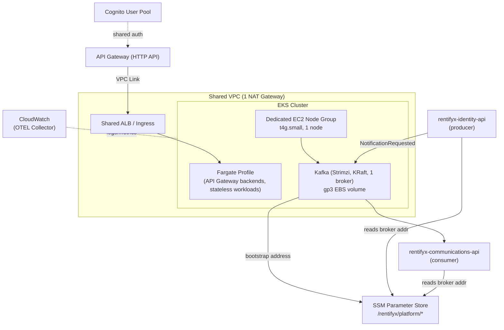

# Rentifyx Platform

`rentifyx-platform` is the shared AWS infrastructure repository for the RentifyX ecosystem. Its goal is to provide a reusable, low-cost platform foundation that other RentifyX services can build on.

## What this repository is for

This repo defines the platform-level infrastructure that should be shared across services, including:

- Terraform remote state backend and safe environment setup
- VPC with a shared NAT Gateway and private subnets
- EKS cluster running on Fargate to avoid idle EC2 costs
- A dedicated EC2 node group running a self-hosted Kafka cluster (KRaft mode, single broker) shared
  by `rentifyx-identity-api` (producer) and `rentifyx-communications-api` (consumer) — see
  `docs/adr/001-shared-kafka-on-eks.md`
- Shared HTTP entry point via API Gateway + VPC Link + ALB
- Cognito User Pool for centralized identity management
- Observability skeleton using OpenTelemetry and CloudWatch
- GitHub Actions validation for Terraform, tflint, and Checkov

## Architecture

Cross-repo config (like the Kafka broker address) is published to SSM Parameter Store rather than
shared via `terraform_remote_state`, so no repo needs read access to another repo's Terraform
state — see ADR-005 (referenced in `rentifyx-plan.md.md`).

## Why it exists

The intention is to minimize ongoing AWS costs while still using managed services. This repository targets a single production environment and defers expensive or complex items until a later phase.

Key cost-focused decisions:

- Single environment only (`prod`)
- One shared NAT Gateway instead of one per AZ
- EKS on Fargate rather than EC2 node groups
- Shared ALB/Ingress instead of one per microservice
- CloudWatch free-tier observability instead of a paid service

## Repository structure

- `modules/` — Terraform module skeletons:
  - `network/`
  - `eks/`
  - `kafka/` — dedicated EC2 node group + Strimzi Kafka (KRaft, single broker) + SSM publish
  - `api-gateway/`
  - `cognito/`
  - `observability/`
- `prod/` — environment-specific Terraform entrypoint
- `scripts/` — support scripts for bootstrap and teardown
- `docs/adr/` — architectural decision records
- `.specs/project/` — project vision, roadmap, and state tracking
- `.github/` — GitHub Actions workflow and PR template

## Current status

This repository currently contains scaffolding and configuration templates. Most modules are skeletons and must be completed before provisioning any AWS infrastructure.

## Getting started

1. Copy `terraform.tfvars.example` to `terraform.tfvars` and update values.
2. Review `backend.tf` and configure the S3/DynamoDB backend for remote state.
3. Complete the Terraform module implementations in `modules/`.
4. Validate the repository with:
   - `terraform fmt -check`
   - `terraform init`
   - `terraform validate`
5. Use `.github/workflows/terraform.yml` for CI validation on pull requests.

## Provisioning pipeline

This repository is intended to follow a gated provisioning flow:

1. Validate changes in a feature branch.
2. Open a pull request that runs the GitHub workflow in `.github/workflows/terraform.yml`.
3. Review the plan and security checks before merge.
4. Merge only when the Terraform configuration is complete and the workflow passes.
5. Provision resources from the `prod/` entrypoint using Terraform in a controlled environment.

### Expected local provisioning steps

1. Ensure `terraform.tfvars` is configured with the correct AWS region, state bucket, and lock table.
2. Run `terraform init` in the root directory.
3. Run `terraform plan -out=tfplan`.
4. Inspect the plan output carefully.
5. Run `terraform apply "tfplan"` only after the plan is approved.

### CI validation flow

- `terraform fmt -check`
- `terraform init`
- `terraform validate`
- `tflint --module`
- `checkov -d .`

## Recommended workflow

- Keep `prod/` as the single environment entrypoint.
- Do not create a staging environment yet.
- Do not provision resources until all module logic is implemented.
- Use PR reviews to verify Terraform changes and cost guardrails.

## Notes

- `pull_request.md` is a repository helper, but GitHub uses `.github/PULL_REQUEST_TEMPLATE.md` automatically.
- The current state is intentionally conservative: only scaffolding and governance should exist now.
- The repository should be updated as each platform module is implemented, not by provisioning incomplete infrastructure.
