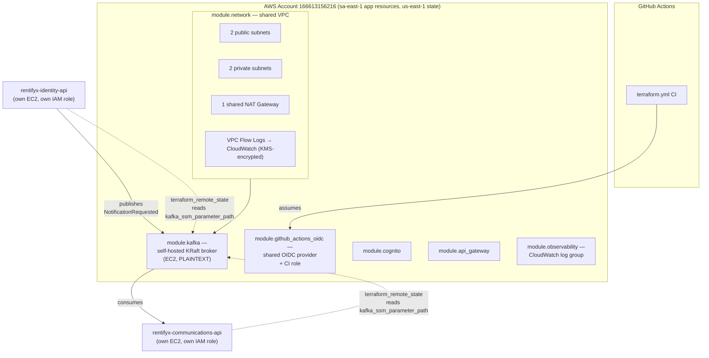

# RentifyX Platform

[](https://github.com/eugeniobandeira/rentifyx-platform/actions/workflows/terraform.yml)
[](LICENSE)

Shared AWS infrastructure for the RentifyX ecosystem — the network, messaging backbone, and
cross-cutting services that no single microservice should own by itself.

## Why this repo exists

Each RentifyX service ([`identity-api`](https://github.com/eugeniobandeira/rentifyx-identity-api),
[`communications-api`](https://github.com/eugeniobandeira/rentifyx-communications-api)) owns its
*own* infrastructure — its own EC2 instance, its own DynamoDB table, its own IAM role. But some
things genuinely belong to neither: the VPC both services' EC2 instances sit in, and the Kafka
broker that lets `identity-api` publish `NotificationRequested` events for
`communications-api` to consume without knowing anything about how the other one is deployed.
That's this repo's entire job — nothing here should be duplicated in a service repo, and nothing
service-specific should end up here.

The project also deliberately prioritizes **cost over high availability**: single environment
(`prod`), one shared NAT Gateway instead of one per AZ, managed serverless services over
self-hosted ones wherever the trade-off is close. See [Decisions](#decisions) below for where that
philosophy was tested and, in one case, reversed.

## Architecture



`module.kafka` exposes `ssm_parameter_path` at root (`outputs.tf`) so the two service repos can
resolve the broker's bootstrap address via `terraform_remote_state` without this repo ever
needing to know their IAM role names. See
[`.specs/features/self-hosted-kafka/`](.specs/features/self-hosted-kafka/) for why MSK
Serverless (SASL/IAM) was replaced with a self-hosted broker (PLAINTEXT) on 2026-07-21 — cost.

## Decisions

Full ADRs: [`docs/adr/`](docs/adr/).

- **[ADR-001](docs/adr/001-shared-kafka-on-eks.md)** (superseded) — the original design ran Kafka
  self-hosted (Strimzi, KRaft, single broker) on a dedicated EC2 node group inside an EKS cluster,
  chosen specifically to *learn* real Kafka operations rather than take the cheapest path.
- **[ADR-002](docs/adr/002-msk-serverless.md)** — reversed that decision. Not purely on cost (MSK
  Serverless isn't obviously cheaper) but because EKS turned out to be dead weight: nothing else in
  this platform needs a Kubernetes cluster (`identity-api` deploys via its own EC2 module, not EKS
  pods), and the EKS-based design had an unavoidable apply-ordering chicken-egg (Kafka's Kubernetes
  resources needed a cluster that didn't exist yet in the same `apply`). MSK Serverless with
  SASL/IAM auth removes both problems. The trade-off is real and stated plainly in the ADR: less
  hands-on Kafka-operations learning, which was the original point.

## Repository structure

```
modules/
  network/              — VPC, subnets, NAT Gateway, flow logs, default SG lockdown
  kafka/                — self-hosted Kafka broker (EC2, KRaft), security group, SSM parameter
  github-actions-oidc/  — shared GitHub Actions OIDC provider + CI role
  api-gateway/           — HTTP API Gateway (not yet wired to a backend)
  cognito/               — Cognito User Pool (not yet consumed by either service)
  observability/         — CloudWatch log group for OTel export
docs/
  adr/                  — architectural decision records
.specs/project/         — vision, roadmap, state tracking (source of truth for progress)
.github/workflows/
  terraform.yml         — fmt/init/validate/tflint/checkov on every PR + push to main
```

## Current status

`terraform validate`/`plan` succeed end-to-end. `terraform apply` has **not** been run for the
bulk of this repo (`network`/`kafka`/`api-gateway`/`cognito`/`observability`) — real, billable AWS
resources (NAT Gateway, Kafka broker EC2), applied only with explicit confirmation. The one thing
actually applied for real: `module.github_actions_oidc` (the CI role both this repo's own workflow
and eventually the service repos' deploy workflows assume).

See [`.specs/project/STATE.md`](.specs/project/STATE.md) for the up-to-date, detailed state —
this README describes what the system *is*, STATE.md tracks what's actually been *done*.

## Getting started

```bash
cp terraform.tfvars.example terraform.tfvars   # fill in real values
terraform init \
  -backend-config="bucket=rentifyx-tfstate-166613156216" \
  -backend-config="key=platform/terraform.tfstate" \
  -backend-config="region=us-east-1" \
  -backend-config="dynamodb_table=rentifyx-tflock"
terraform plan
```

Apply in stages, not all at once — `module.kafka` needs `module.network`'s outputs:

```bash
terraform apply -target=module.network
terraform apply -target=module.kafka
terraform apply   # the rest (api-gateway, cognito, observability)
```

### Tearing down

`rentifyx-identity-api` and `rentifyx-communications-api` read this repo's outputs via
`terraform_remote_state` (Kafka client policy, shared SES identity) — destroy those two repos'
resources **first**, then this repo, so nothing is left pointing at a destroyed dependency:

```bash
terraform destroy
```

Real, billable resources this creates (NAT Gateway, MSK Serverless, SES identity) all get torn
down. The Terraform state backend (S3 bucket / DynamoDB lock table) is not managed by this repo's
`terraform destroy` and is left alone.

## CI

`.github/workflows/terraform.yml` runs on every push to `main` and every PR:

```
terraform fmt -check → terraform init → terraform validate → tflint --call-module-type=all → checkov -d .
```

Authenticates via the OIDC role above (`AWS_DEPLOY_ROLE_ARN` repo secret) — no long-lived AWS
credentials stored in GitHub.

## License

MIT © eugeniobandeira
