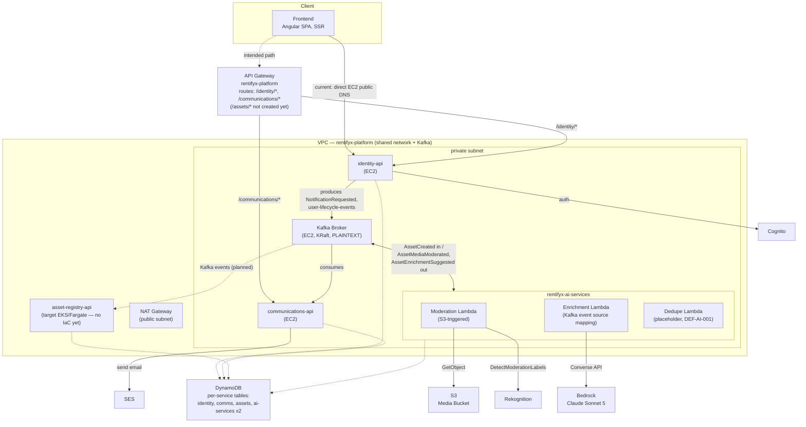

# RentifyX System Architecture

Cross-repo view: services, shared infra, and event flow. Compiled from each repo's `CLAUDE.md`/`README.md`/`.specs/codebase/ARCHITECTURE.md` and this repo's root `main.tf`/`outputs.tf`. Canonical home for this doc is `rentifyx-platform` since it's cross-cutting, shared infra documentation, not specific to one service.

## Diagram

## Kafka topics (event contracts)

| Topic | Producer | Consumer(s) |
|---|---|---|
| `AssetCreated` | asset-registry-api | rentifyx-ai-services (Moderation, S3-triggered off the referenced object) |
| `AssetMediaModerated` (v2), `AssetPendingManualReview` | rentifyx-ai-services (Moderation) | asset-registry-api |
| `AssetEnrichmentSuggested` | rentifyx-ai-services (Enrichment) | asset-registry-api |
| `NotificationRequested` (+ retry/DLQ) | identity-api | communications-api |
| `user-lifecycle-events` (`UserAccountDeleted`, `UserSuspended`) | identity-api | communications-api, asset-registry-api |

## Services

### rentifyx-platform (shared infra, no service logic of its own)
- **Network**: VPC, 2 public + 2 private subnets, 1 shared NAT Gateway, KMS-encrypted VPC Flow Logs → CloudWatch.
- **Kafka**: single EC2 KRaft broker, PLAINTEXT, SG scoped to VPC CIDR. Bootstrap address published via SSM parameter (`kafka_ssm_parameter_path` output).
- **API Gateway**: HTTP API v2, pass-through routing to identity-api/communications-api EC2 instances by public DNS (read via `terraform_remote_state` from those repos). No VPC Link.
- Also provisions Cognito (not yet consumed), a shared SES sender identity, GitHub Actions OIDC, and a CloudWatch observability log group.
- **Lesson learned the hard way** (rentifyx-ai-services' first live deploy, 2026-07-24): a Lambda ENI never gets a public IP regardless of the subnet's IGW route — anything needing AWS API egress (DynamoDB, Rekognition, SQS, Bedrock) must sit in `private_subnets` (NAT egress), not `public_subnets`.

### rentifyx-identity-api
- Auth/identity microservice: register, login, refresh, logout, password reset, LGPD data export/erasure/consent.
- Compute: own EC2 instance, own IAM role, deployed via Terraform + GitHub Actions OIDC.
- Owns: DynamoDB, Cognito, SES, Secrets Manager, KMS — real AWS even in local dev (no LocalStack).
- Exposes REST under `/api/v1` (JWT RS256, refresh via httpOnly cookie). Publishes `NotificationRequested` and `user-lifecycle-events`.

### rentifyx-communications-api
- Channel-agnostic notification dispatch (v1 = email via SES). Kafka-triggered only — no HTTP endpoint to *request* a send.
- Compute: own EC2 instance, same pattern as identity-api.
- Consumes `NotificationRequested` (+ retry/DLQ) from identity-api.
- Exposes 4 backend-only HTTP endpoints (notification lookup, consent get/put) gated by a static `X-Api-Key` — not meant for browser/frontend use.

### rentifyx-asset-registry-api
- Asset catalog: creation, categorization, presigned-S3 media uploads, search, moderation state.
- Target compute is EKS/Fargate per its own `CLAUDE.md`, but **no deploy/IaC exists yet** — this repo's `/assets` API Gateway route is `count = 0`.
- Owns: DynamoDB (single-table), S3 (media), Secrets Manager, KMS.
- Publishes `AssetCreated`/`AssetMediaUploaded`/`AssetPublished`/`AssetSuspended` via an outbox-poll pattern. Consumes `user-lifecycle-events` (identity-api) and `AssetMediaModerated`/`AssetEnrichmentSuggested` (rentifyx-ai-services). JWT validated against identity-api's public key (RS256) — no shared secret between services.

### rentifyx-ai-services
- Three Lambdas: **Moderation** (S3 ObjectCreated-triggered, calls Rekognition `DetectModerationLabels`), **Enrichment** (Kafka event-source-mapping-triggered, calls Bedrock Converse API), **Dedupe** (placeholder scaffold, `DEF-AI-001`, not implemented).
- Event-only — never exposes synchronous HTTP endpoints.
- Consumes `AssetCreated` (indirectly, via the S3 object it references); publishes `AssetMediaModerated`/`AssetPendingManualReview`/`AssetEnrichmentSuggested` back to asset-registry-api.
- Own idempotency DynamoDB tables (one per Lambda) and its own S3 media bucket (provisioned in that repo, not platform — domain-specific infra decision, 2026-07-24).

### rentityx-frontend
- Angular 22 SPA (SSR via `@angular/ssr` + Express). Identity feature implemented: auth, session, LGPD data export/delete.
- No AWS infra of its own. Talks directly to identity-api's EC2 public DNS today (`{host}/api/v1`, Bearer JWT + refresh cookie) — **not yet routed through** this repo's API Gateway, despite that gateway already having an `/identity/*` route.
- Deliberately does **not** integrate with communications-api (its API-key auth scheme is unsuitable for a browser SPA) or talk to Kafka directly.

## Open gaps (as of 2026-07-24)

- `rentifyx-asset-registry-api` has no deploy/IaC — its Kafka consumers for `AssetMediaModerated`/`AssetEnrichmentSuggested` and its API Gateway route don't exist in AWS yet.
- Frontend bypasses the API Gateway, hitting identity-api's EC2 directly.
- Cognito (provisioned here) isn't consumed by any service yet — identity-api's own auth flow doesn't currently integrate with it (worth confirming if this is intentional or drift).
- `rentifyx-ai-services`' Kafka event source mapping (Enrichment) was blocked by Kafka broker instability during its first real deploy (OOM on a `t3.micro` broker) — fixed in code (`t3.small` + capped JVM heap) but not yet re-verified against real AWS.
